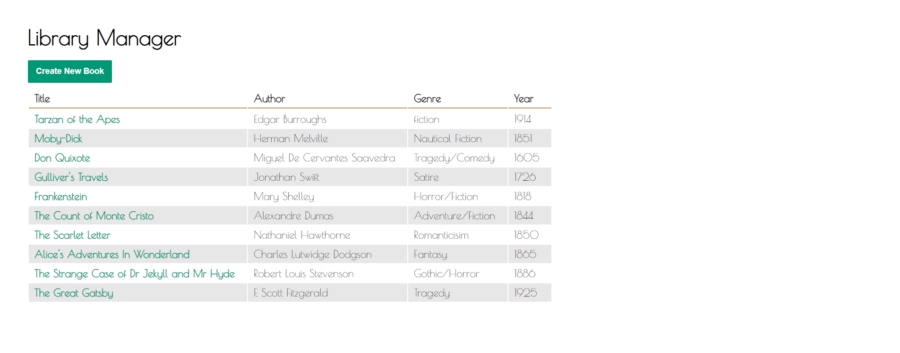

# libraryApp

CRUD application using express and sequelize to store and manage book information.

# Install
npm install

# Run
npm start

# App outline

* App main menu

* update-book form

# Skills

* express routing

* Sequelize ORM

* form validation with sequelize ORM

* 404 route and global error handling with middelware

* Using query strings for dynamic routing
